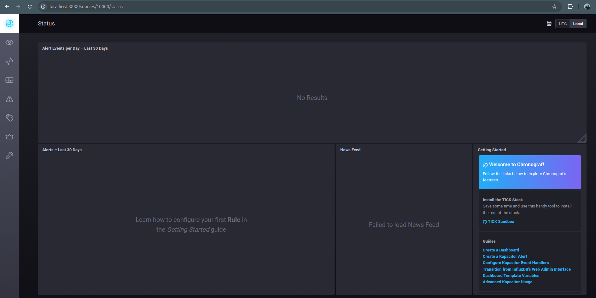
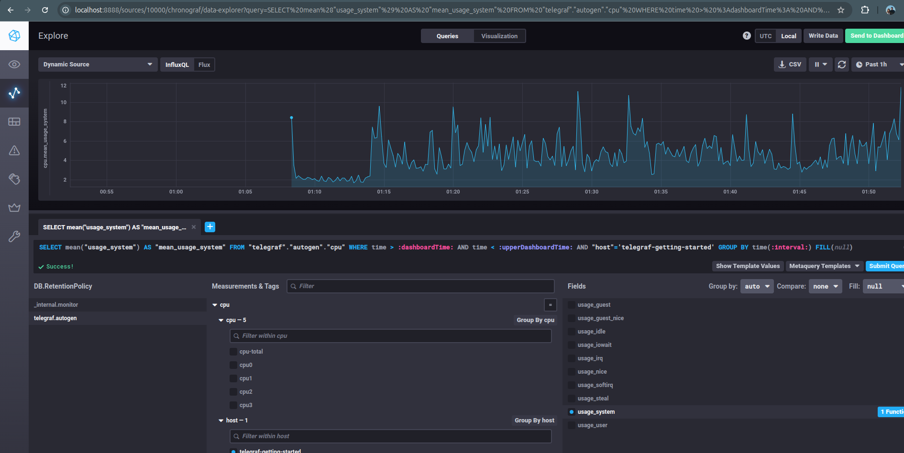
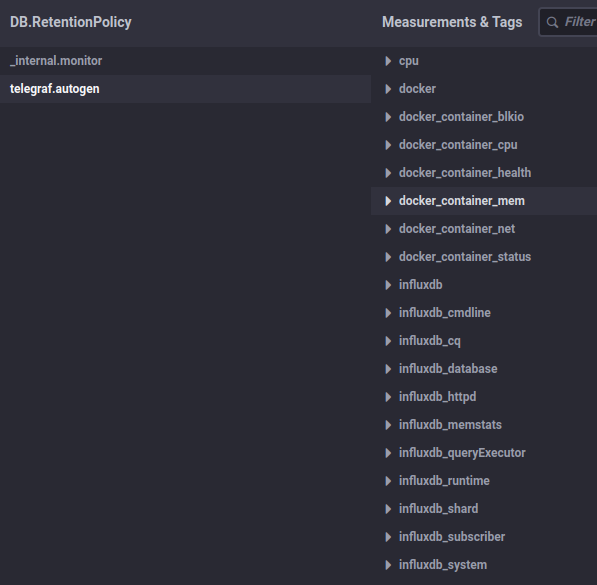

[Задание](https://github.com/netology-code/mnt-homeworks/blob/MNT-video/10-monitoring-02-systems/README.md)

#### Вопрос:
1. Вас пригласили настроить мониторинг на проект. На онбординге вам рассказали, что проект представляет из себя платформу для вычислений с выдачей текстовых отчетов, которые сохраняются на диск. Взаимодействие с платформой осуществляется по протоколу http. Также вам отметили, что вычисления загружают ЦПУ. Какой минимальный набор метрик вы выведите в мониторинг и почему?

##### Ответ:
1. Загруженность ЦПУ: общую и по ядрам, чтобы визуально было понятно, насколько загружен процессор и выявить возможности неравномерной нагрузки.
2. Состояние HTTP сервиса, для своевременного отслеживания падения сервиса.
3. Количество запросов в промежуток времени, с кодами ответов, для выявления запросов, вызывающих ошибки.
4. Загруженность RAM: общая загруженность и swap, чтобы вовремя принять решение о расширении, когда это будет необходимо.
5. Загруженность дисковой системы, чтобы избежать износа системы хранения.
6. Если есть очередь, то полезно мониторить рост длины очереди, он будет сигнализировать о замедленной обработке данных.
7. Если сервер физический, то полезно мониторить температуру ЦПУ, чтобы при критических значениях, возможно, приостанавливать работу сервиса, или для принятия решения о расширении.

#### Вопрос:
2. Менеджер продукта посмотрев на ваши метрики сказал, что ему непонятно что такое RAM/inodes/CPUla. Также он сказал, что хочет понимать, насколько мы выполняем свои обязанности перед клиентами и какое качество обслуживания. Что вы можете ему предложить?
##### Ответ:

RAM/inodes/CPU LA - внутренние технические метрики, которые помогают инженерам поддерживать инфраструктуру. Однако они напрямую не связаны с восприятием сервиса клиентами. 

- RAM - (RAM/swap) - позволяет получить информацию об утечках памяти или переполнению контекстов в работе приложения.
- inodes - позволяет следить за переполнением индексных дескрипторов, что делает невозможным создание новых файлов.
- CPU LA - информация о нагрузке на процессор, слишком высокая нагрузка может свидетельством о том, что необходимо масштабирование или рефакторинг приложения.

Чтобы понимать, насколько выполняются обязанности по качеству обслуживания, должны быть определено значение по каждой из метрик:

**SLA** — Service Level Agreement - **обязательство** перед клиентом, в котором обязуемся обеспечивать определённые значения. Например:
- **response time** - Время отклика будет не более 200 мс.
- **availability** - Сайт в доступе будет 99% времени.
- **error rate** - Не более 20 неудачных ответов на 10тыс. запросов, т.е. 0.2%

Также важно внутри компании определить  
**SLO** — Service Level Objective - **цель**, к которой мы стремимся, чтобы удовлетворять SLA. Например:
- Время отклика должно быть <= 100 мс.
- Наш сайт должен быть в доступе 99.9% времени.
- error rate 0.1

Измерять это всё будем  
**SLI** - Service Level Indicator - **индикатор**, например:
- проводить health-check каждые 5 секунд и считать процент успешных проверок за час/месяц.
- отслеживать время ответа на HTTP-запросы
- Считать процент запросов, завершившихся с HTTP-кодами >= 400.

#### Вопрос:
Вашей DevOps команде в этом году не выделили финансирование на построение системы сбора логов. Разработчики в свою очередь хотят видеть все ошибки, которые выдают их приложения. Какое решение вы можете предпринять в этой ситуации, чтобы разработчики получали ошибки приложения?
###### Ответ:
Настройка Sentry для отслеживания ошибок приложений


#### Вопрос:
Вы, как опытный SRE, сделали мониторинг, куда вывели отображения выполнения SLA=99% по http кодам ответов. Вычисляете этот параметр по следующей формуле: summ_2xx_requests/summ_all_requests. Данный параметр не поднимается выше 70%, но при этом в вашей системе нет кодов ответа 5xx и 4xx. Где у вас ошибка?
###### Ответ:
Ошибка в summ_2xx_requests. Нужно учитываь не только коды 2xx, но также 3xx. Теоретически существуют и 1xx, так что правильнее было бы считать их тоже. Это выглядело бы так:

`SLI (успешность запросов) = (summ_1xx_requests + summ_2xx_requests + summ_3xx_requests) / summ_all_requests`

#### Вопрос:
Опишите основные плюсы и минусы pull и push систем мониторинга.
###### Ответ:
###### Push, плюсы
- упрощение репликации данных. Агенты отправляют данные в систему мониторинга, что позволяет легко дублировать (реплицировать) данные в несколько систем мониторинга или резервные копии. Один и тот же агент может направлять информацию одновременно в несколько разных систем мониторинга.

- гибкость настройки отправки данных. Агенты можно настроить на отправку данных с разными интервалами или частотой, а также выбрать, какие конкретно метрики передавать.

- меньше накладных расходов на использование UDP. В push-системах часто используется протокол UDP для отправки метрик,что снижает накладные расходы на установку соединения и контроль целостности передаваемых данных. Это повышает общую производительность, так как система меньше тратит ресурсов на обработку передачи.

###### Push, минусы

- Контроль данных становится сложнее. Системе мониторинга сложнее верифицировать подлинность подлинность данных или безопасность.
- Необходимость в настройке агентов. Каждый агент должен быть настроен для отправки данных, что требует более сложной конфигурации всей системы.
- Проблемы с потерей данных при использовании UDP. Если UDP-пакет теряется, данные могут быть утеряны, так как этот протокол не гарантирует доставки.
- Трудности с централизованной отладкой. Проблемы в отдельных агентах, передающих данные, может быть трудно детектировать с точки зрения системы мониторинга, особенно в масштабных инфраструктурах.

###### Pull, плюсы
- Контроль подлинности данных. Система мониторинга сама запрашивает данные у агентов, что облегчает контроль за их подлинностью. Вы точно знаете, что именно запросила система, и защищаете себя от некорректных данных.
- Централизация управления через proxy-сервер. Можно настроить единый прокси или API-шлюз между агентов и сервером мониторинга, применив различные формы аутентификации, авторизации и шифрования (например, TLS). Это значительно упрощает централизованное управление сетью агентов.
- Упрощенная отладка. Если данные не доходят до системы мониторинга, их отсутствие легко заметить, так как запросы отправляются централизованно. Кроме того, можно быстро локализовать источник проблем.
- Гибкость на стороне системы мониторинга. Система мониторинга может выбирать, какие данные и с какой частотой запрашивать у агентов, что добавляет гибкости в управлении метриками.

###### Pull, минусы
- Высокая нагрузка на сервер сбора метрик. В случае масштабной инфраструктуры (сотни или тысячи агентов) сервер мониторинга может испытывать значительную нагрузку из-за большого количества запросов, особенно при наличии множества метрик.
- Сложности с репликацией данных. При использовании pull-подхода сервер мониторинга сам забирает данные, поэтому репликация данных в другие системы может потребовать дополнительной настройки.
- Ограничения в сети. Сервер мониторинга должен иметь сетевой доступ ко всем агентам, что может быть проблематично в сложных сетевых топологиях, например в изолированных или защищенных сегментах сети.
- Увеличение задержек. Время получения метрик ограничено интервалами запросов: сервер мониторинга опрашивает агенты по заранее настроенному расписанию, что делает систему менее оперативной в реагировании.

#### Вопрос:
Какие из ниже перечисленных систем относятся к push модели, а какие к pull? А может есть гибридные?

###### Ответ:
- Prometheus - pull
- TICK - push. Агенты (Telegraf) отправляют данные в InfluxDB.
- Zabbix - гибридный, работает с обоими моделями
- VictoriaMetrics - гибридный, работает с обоими моделями
- Nagios - pull

#### Задача:
7. Склонируйте себе [репозиторий](https://github.com/influxdata/sandbox/tree/master) и запустите TICK-стэк, 
используя технологии docker и docker-compose.  
В виде решения на это упражнение приведите скриншот веб-интерфейса ПО chronograf (`http://localhost:8888`).   
P.S.: если при запуске некоторые контейнеры будут падать с ошибкой - проставьте им режим `Z`, например
`./data:/var/lib:Z`

###### Ответ:
`git clone https://github.com/influxdata/sandbox.git`  
`cd sandbox`  
`sandbox up`  
`docker compose up -d`  




#### Задача:
Перейдите в веб-интерфейс Chronograf (http://localhost:8888) и откройте вкладку Data explorer.

Нажмите на кнопку Add a query
Изучите вывод интерфейса и выберите БД telegraf.autogen
В measurments выберите cpu->host->telegraf-getting-started, а в fields выберите usage_system. Внизу появится график утилизации cpu.
Вверху вы можете увидеть запрос, аналогичный SQL-синтаксису. Поэкспериментируйте с запросом, попробуйте изменить группировку и интервал наблюдений.
###### Ответ:


#### Задача:
9. Изучите список [telegraf inputs](https://github.com/influxdata/telegraf/tree/master/plugins/inputs). 
Добавьте в конфигурацию telegraf следующий плагин - [docker](https://github.com/influxdata/telegraf/tree/master/plugins/inputs/docker):
```
[[inputs.docker]]
  endpoint = "unix:///var/run/docker.sock"
```
Ответ:

